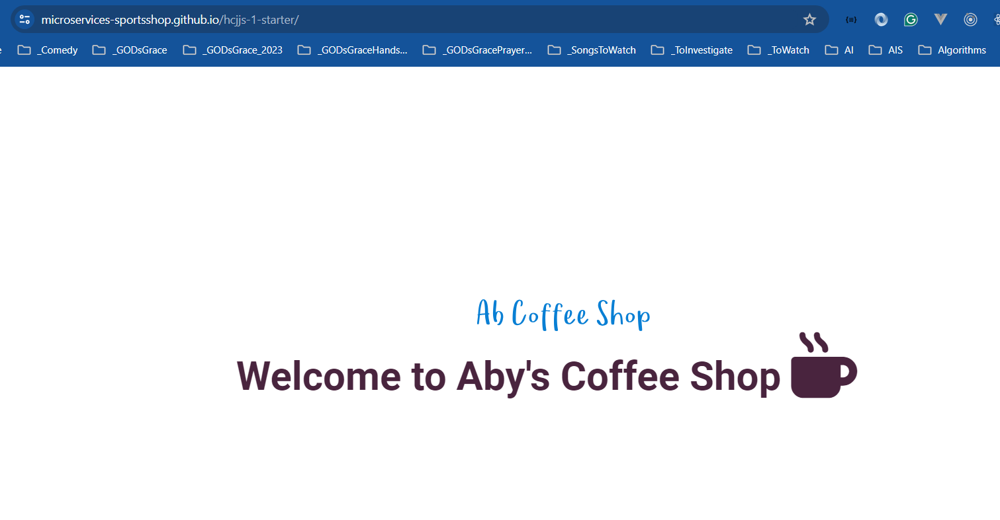

# HTML, CSS, and JavaScript Starter Project

This is the Starter Repository for all Html, Css, and JavaScript Projects

## Reference(s)

> 1. [https://www.w3schools.com/html/default.asp](https://www.w3schools.com/html/default.asp)
> 1. [https://developer.mozilla.org/en-US/](https://developer.mozilla.org/en-US/)
> 1. <https://docs.emmet.io/cheat-sheet/>
> 1. <https://code.visualstudio.com/docs/editor/emmet>
> 1. <https://cdnjs.com/libraries/font-awesome>
> 1. <https://fontawesome.com/search?q=apple&o=r>
> 1. <https://favicon.io/emoji-favicons/dizzy>
> 1. <https://colorhunt.co/>
> 1. <https://fonts.google.com/>
> 1. <https://svglogomaker.com/>

## Hosted URL

> 1. <https://microservices-sportsshop.github.io/hcjjs-1-starter/>

